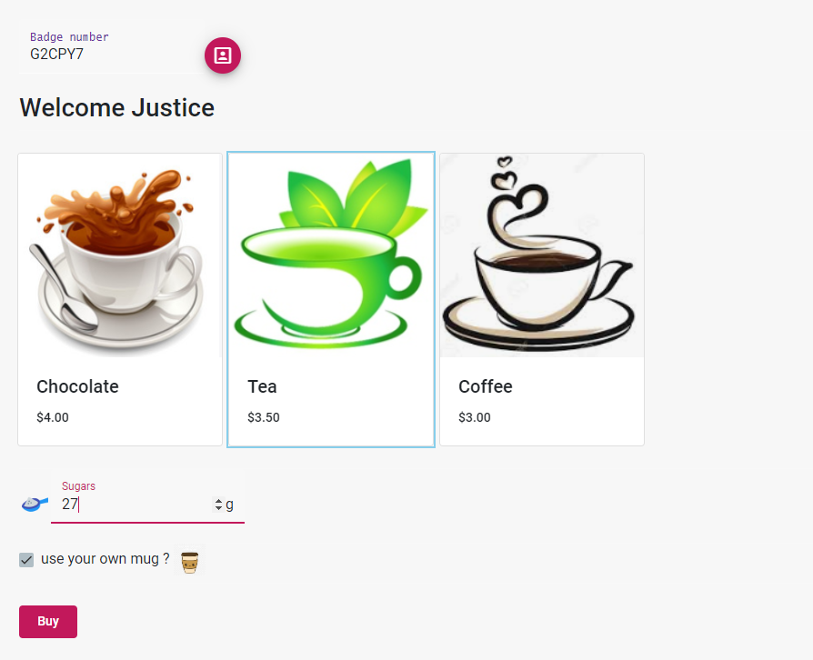

# Coffee-Machine
Coffee-Machine full stack application
 - Front end (folder CoffeeClientApp): 
    - Angular 9 
    - Angular Material 9
    - jasmine For basic UI and service test
 - Backend
   - ASP.NET Core 3.1 web API 
   - EF Core 3.1 
   - XUnit, use EF InMemory database to test services
   - Sql server localdb

